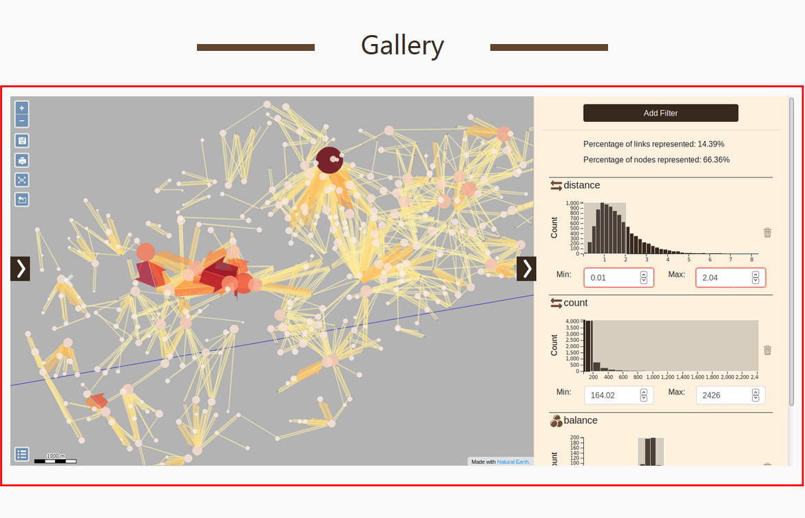
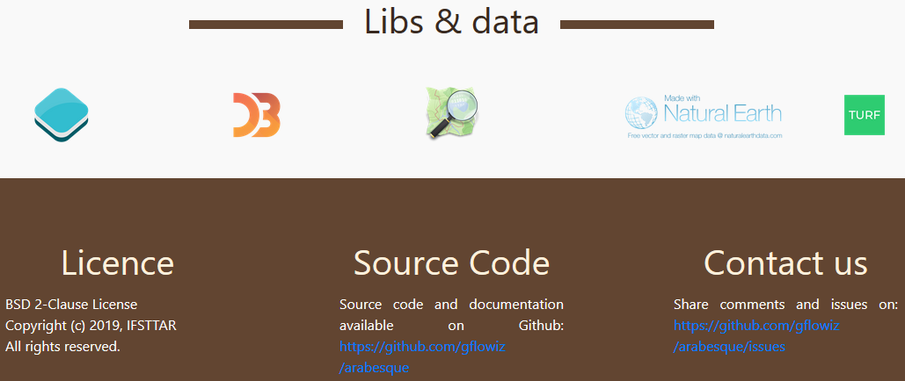

# Main page

The main page welcomes you and provides several informations about the application
and a couple ways to enter it.

It is a page that you can scroll down. It is segmented in several parts:

* Welcome page
* Documentation and demos
* Gallery
* General informations on the Gflowiz project
* Detailed informations on the Arabesque application

##  Welcome page

1. Arabesque logo : click on it to return to the main page
2. Gallery button : to go directly to the gallery
3. Guide button : go to the guide
4. Project : visit the project website
5. New map : creating a new map with you own dataset
6. Load saved map : reload a map you created before
7. Scroll down to access more informations

## Documentation and demos

1. You can come to this documentation by clicking on the link
2. Arabesque comes with 2 preloaded maps on several subjects:
  
  * London Bike Traffic
  * Swiss Migration

## Gallery

A caroussel display several screenshots of maps realized with Arabesque.

## General informations

The main page provides general information on :

1. the application (funding and
contributors)
2. the Gflowiz project that Arabesque is part of.

## Detailed informations

Finally you can find detailled informations about the application :

* Software libraries
* Source datasets
* Licence
* Link to the source code
* Contact us policy

