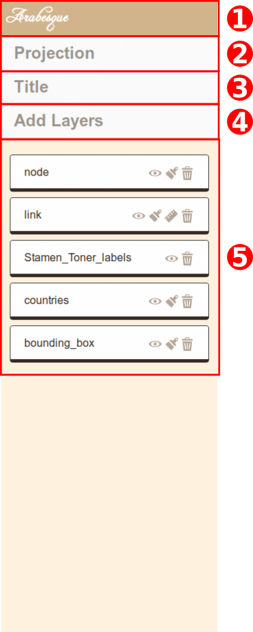
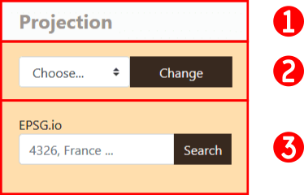

# Functionnalities

## Launching an example

In order to test the differents functionnalities provided by Arabesque, we will use the Swiss communting demo. 
Please find it in the Demo section and  click on the `Explore` button (`1`).

You might be greeted by a warning message. This is normal, if Arabesque find nodes
without links or links without nodes, it will remove them. It is based on a 
join on nodes IDs.

1. Click on `Ok`.

## Panels

Arabesque is divided in 3 panels:

1. Layer management panel
2. Map panel
3. Data handling panel

The side panels (layer and data) can be hidden by clicking on the arrows on the side. 

### Layer management panel

The layer panel contains several buttons and tools to handle the layers.

1. Home button to get back to Welcome page
2. Projection : click to deploy the projection tool
3. Title : dialog box to change map title
4. Add layers: toolbox to add layers
5. Layers : area where you can manipulate the layer

Let's see those how they work.

#### Projection tool

By default, entry data and project are into WGS84 (EPSG:4326), which is a Geographic Coordinnate system.
If it is great for dataset on a global scale, for more local ones, it might be
interesting to use *projected coordinate system*.
Arabesque provides a series of preset projection but you can also provide an 
EPSG code and the application will look for its definition on the website [epsg.io](https://epsg.io).

1. Click on the *Projection* button to deploy the toolbox
2. You can choose a projection from the list of provided ones
3. Or you can enter an EPSG code to get the definition from the web.

### Map panel

### Data handling panel

