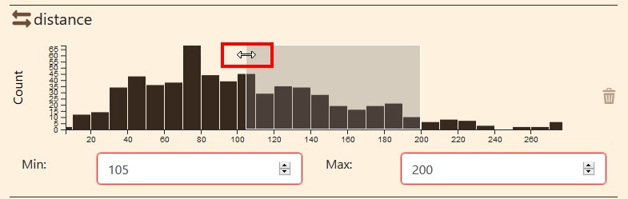
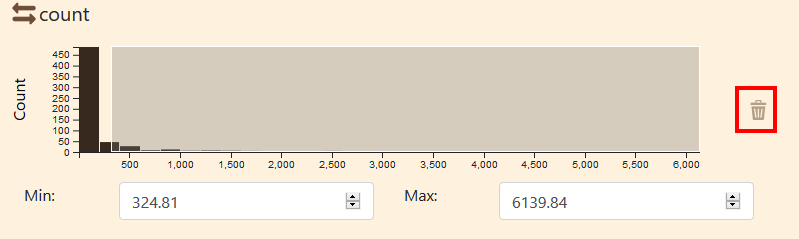

# Functionnalities

## Launching an example

In order to test the differents functionnalities provided by Arabesque, we will use the Swiss communting demo. 
Please find it in the Demo section and  click on the `Explore` button (`1`).

You might be greeted by a warning message. This is normal, if Arabesque find nodes
without links or links without nodes, it will remove them. It is based on a 
join on nodes IDs.

1. Click on `Ok`.

## Panels

Arabesque is divided by default in 3 panels:

1. Layer management panel
2. Map panel
3. Data handling panel

The side panels (layer and data) can be hidden by clicking on the arrows on the side. 

### Layer management panel

The layer panel contains several buttons and tools to handle the layers.

1. Home button to get back to Welcome page
2. Projection : click to deploy the projection tool
3. Title : dialog box to change map title
4. Add layers: toolbox to add layers
5. Layers : area where you can manipulate the layer

Let's see those how they work.

#### Projection tool

By default, entry data and project are into WGS84 (EPSG:4326), which is a Geographic Coordinnate system.
If it is great for dataset on a global scale, for more local ones, it might be
interesting to use *projected coordinate system*.
Arabesque provides a series of preset projection but you can also provide an 
EPSG code and the application will look for its definition on the website [epsg.io](https://epsg.io).

1. Click on the *Projection* button to deploy the toolbox
2. You can choose a projection from the list of provided ones
3. Or you can enter an EPSG code to get the definition from the web.

##### Use a predefined projection

1. Click on the button to deploy the drop-down list
2. Choose the projection you want
3. Click on *Change* to change the map projection to the new one

### Map panel

The map panel cannot be hide, it is always visible.
The map is automatically redraw when a side panel is opened/close.

1. Zoom in
2. Zoom out
3. Save project (archive the project settings in a zip file)
4. Export map as png file
5. Center map on current links
6. Export filtered data (csv in zip file)
7. Display fullscreen map
8. Hide/show layer management panel
9. Hide/show data handling panel
10. Legend
11. Scale
12. Base map attributions

### Data handling panel

The data handling provide several tools to handle nodes and links.

From this panel, you can filter the data with 

1. Add filter button
2. Data summary
3. Distance filter
4. Count filter

The procedure to add a filter is detailed below.

The data summary provides some useful information about the filered information:

- Percentage of link represented on the map
- Percentage of volume represented
- Percentage of node represented

All those values are from the kinks and nodes that were loaded.

Please note that Arabesque automatically filter at first load.

The distance and count filters are provided by default.

## Manipulate filters

The data is represented as an histogram.
Here is the distribution of links size.

The min and max values are also displayed.

You can filter the data with 2 ways:

- change min and max value
- resize and move the data window

### Change min / max

You can change the min and/or the max values in the fields below the histogram.
For example, you want all data from a distance of 60 to 180.
When you enter the new values, the grey window will change to fit the new values.

This window represent the filtered data, the data that are displayed.
This data window can be resized and displaced.

You can also verify that the data summary as changed

## Resize and move the data window

You can move the window by moving the cursor other it. 
When the cursor change to a cross, you can click on it and move it to the left or the right using your mouse.

You can see that the values in the min and max fields and the data summary has change.

You can also resize the window.

When placing the cursor over the edge of the data window, the cursor will change to a left-right arrow.
Click on the edge and move it to the right or the left to resize the window.

Again, min or max values changes and the data summary too. 

## Add a new filter
## Remove filter

To remove a filter, click on the bin icon on the right side of it.