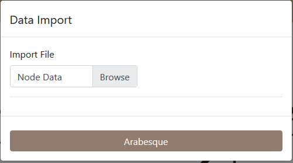
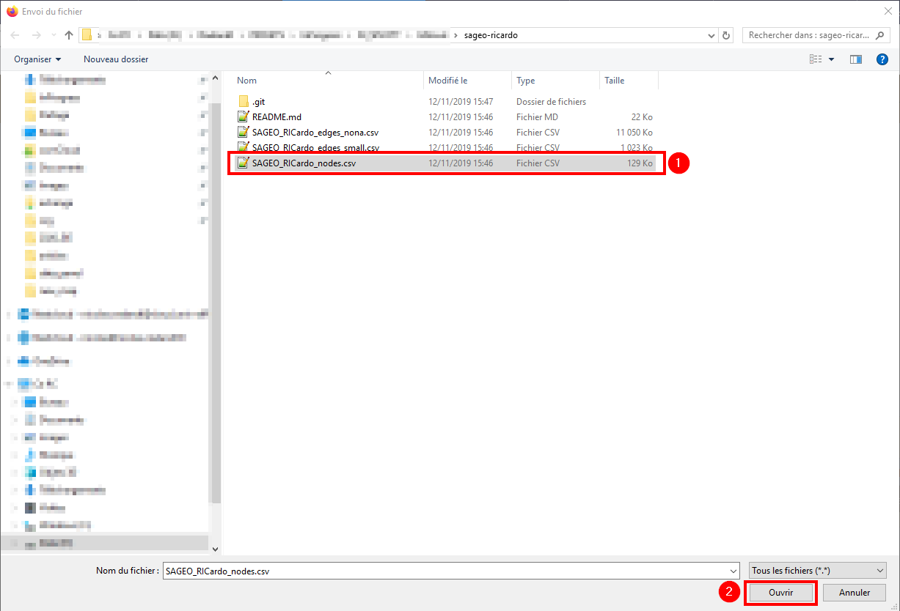
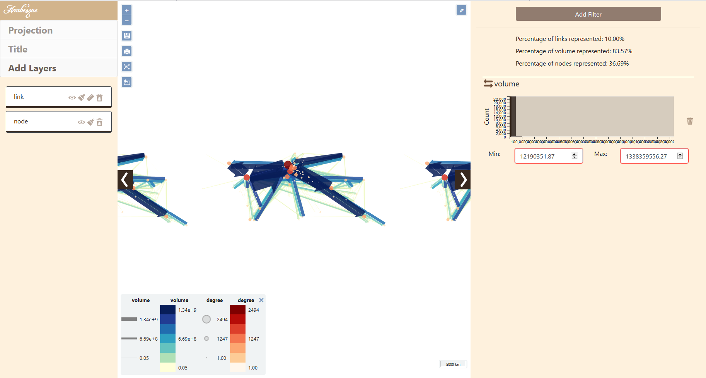

# Import a dataset

In this part, we will show you how to import a dataset into the application.

This example will use the [RICardo dataset](https://github.com/gflowiz/sageo-ricardo) provided here:
https://github.com/gflowiz/sageo-ricardo

This dataset is about goods exchange between countries from the seventeenth century and early twentieth century.

We will use 2 CSV files :

- [SAGEO_RICardo_nodes.csv](https://raw.githubusercontent.com/gflowiz/sageo-ricardo/master/SAGEO_RICardo_nodes.csv) that contains information on the nodes (position mainly);
- [SAGEO_RICardo_edges_small.csv](https://raw.githubusercontent.com/gflowiz/sageo-ricardo/master/SAGEO_RICardo_edges_small.csv) that contains informations on the links (or *edges*) who connects the nodes.

Arabesque will be able to link nodes and egdes using common IDs between those 2 files. Arabesque will automatically remove links or nodes that are not common to the 2 files.

## Load the link data

To create a new map, you first start to load the link data.
To do so, click on the *Browse* button.

Browse your files and select the `SAGEO_RICardo_edges_small.csv` file.

This file is Ricardo data aggregated by decades to make it smaller footprint.

The file `SAGEO_RICardo_edges_nona.csv` contains non aggregated data.

Click on `Open` to load the data in the application.

When the data has been loaded, the filename will appear in the box and you can click on the *Add* button.

## Load the nodes data

A popup window will open to help you select the informations needed by the application.

*Arabesque* works with 3 columns:

- ID of the origin node
- ID of the destination node
- the column containing the information on the transferred volume

The RICardo dataset comes with columns named accordingly but the name is not very important.

You can also choose an aggregation function.
*Arabesque* provides the most common ones (sum, mean, median, maximum, minimum).

Links needs to be spatialized.
This is provided by the nodes.

There is 2 ways to add nodes to the map.
By providing a node file or by using preset locations.

### From a preset dataset

This feature is a work in progress and is not available yet.

### From a file

You can provide your own nodes file.

On the previous menu, click on *Import Location*.
This will pop up the following window.

Click on *Browse*, select the `SAGEO_RICardo_nodes.csv` 
file and click on `Open`.

This files need 3 columns:

- a column containing the node IDs
- a column with the latitude of the node
- a column with the longitude of the node

The node is always a point located in space with decimal geographical coordinates.

Before loading the file, *Arabesque* will need to know which column store IDs and lat/long information.

Use the drop-down lists to assign the right columns.
Click on the *Arabesque* button to launch the map.

## New map
### Removed nodes and links

When *Arabesque* connects nodes and links, it automatically remove orphans nodes (not related to any link) and links (links without nodes).
*Arabesque* will inform you with a popup window.

For example:
> 1382 nodes have been removed. 
> No links have for origin or destination these nodes 

Click on `OK`

### Default map

*Arabesque* will display a default map, with the most significative information and a default theme.

You can modify it like shown in the [Functionnalities section](https://gflowiz.github.io/arabesque/functionnalities.html).